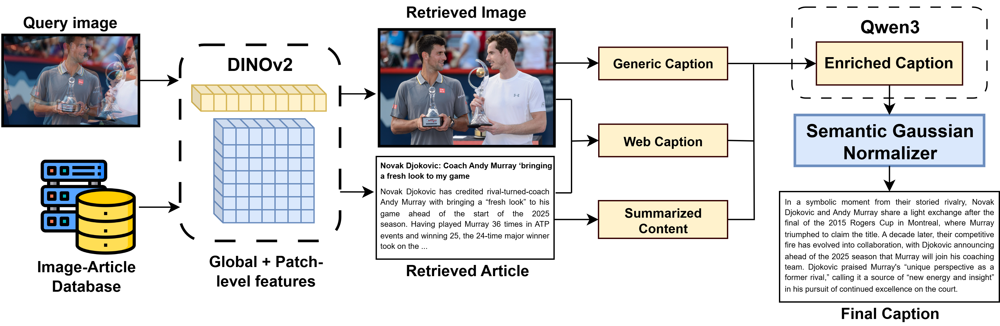

# [ACM MM 2025] ReCap: Event-Aware Image Captioning with Article Retrieval and Semantic Gaussian Normalization

<p align="center">
  <a href="https://arxiv.org/abs/2509.01259"></a>
  <a href="https://doi.org/10.1145/3746027.3762039"></a>
  <a href="https://ltnghia.github.io/eventa/eventa-2025/track1"></a>
  
</p>

<p align="center">
  <a href="https://scholar.google.com/citations?user=tvSOtcIAAAAJ&hl=vi"><strong>Thinh-Phuc Nguyen</strong></a>&nbsp;&nbsp;
  <a href="https://scholar.google.com/citations?user=YGxxJj8AAAAJ&hl=vi&oi=sra"><strong>Thanh-Hai Nguyen</strong></a>&nbsp;&nbsp;
  <a href="https://scholar.google.com/citations?user=ebEYKMwAAAAJ&hl=vi"><strong>Gia-Huy Dinh</strong></a>&nbsp;&nbsp;
  <a href="https://scholar.google.com/citations?user=ZsQ2SdQAAAAJ&hl=vi&oi=sra"><strong>Lam-Huy Nguyen</strong></a>&nbsp;&nbsp;
  <a href="https://scholar.google.com/citations?user=lt2ATkkAAAAJ&hl=vi"><strong>Minh-Triet Tran</strong></a>&nbsp;&nbsp;
  <a href="https://scholar.google.com/citations?hl=vi&user=n8ZQzx8AAAAJ"><strong>Trung-Nghia Le</strong></a>
</p>

<p align="center">
  University of Science, Vietnam National University – Ho Chi Minh City
</p>

---

## Abstract

Image captioning systems often produce generic descriptions that fail to capture event-level semantics which are crucial for applications like news reporting and digital archiving. We present **ReCap**, a novel pipeline for event-enriched image retrieval and captioning that incorporates broader contextual information from relevant articles to generate narrative-rich, factually grounded captions. Our approach addresses the limitations of standard vision-language models that typically focus on visible content while missing temporal, social, and historical contexts. ReCap comprises three integrated components: (1) a robust two-stage article retrieval system using DINOv2 embeddings with global feature similarity for initial candidate selection followed by patch-level mutual nearest neighbor similarity re-ranking; (2) a context extraction framework that synthesizes information from article summaries, generic captions, and original source metadata; and (3) a large language model-based caption generation system with Semantic Gaussian Normalization to enhance fluency and relevance. Evaluated on the OpenEvents V1 dataset as part of Track 1 in the EVENTA 2025 Grand Challenge, ReCap achieved a strong overall score of **0.54666**, ranking **2nd on the private test set**.

---

## Pipeline



The ReCap pipeline consists of three main stages:

1. **Two-Stage Article Retrieval** — DINOv2 global embeddings for candidate selection, followed by patch-level Mutual Nearest Neighbor Similarity (MNNS) re-ranking.
2. **Context Extraction** — Synthesizes article summaries, raw image captions, and source metadata into a unified context representation.
3. **LLM-Based Caption Generation with Semantic Gaussian Normalization** — Generates narrative-rich captions and applies normalization to enforce fluency and factual relevance.

---

## Results

### EVENTA 2025 Private Leaderboard (Track 1)

| Rank | Team | mAP | R@1 | R@10 | CLIPScore | CIDEr | Overall |
|:----:|------|:---:|:---:|:----:|:---------:|:-----:|:-------:|
| 1 | cerebro | 0.991 | 0.989 | 0.995 | 0.826 | 0.210 | 0.55010 |
| **2** | **SodaBread (Ours)** | **0.982** | **0.977** | **0.988** | **0.870** | **0.205** | **0.54666** |
| 3 | Re: Zero Slavery | 0.955 | 0.945 | 0.973 | 0.732 | 0.156 | 0.45148 |
| 4 | ITxTK9 | 0.966 | 0.955 | 0.983 | 0.828 | 0.133 | 0.42002 |
| 5 | noname\_ | 0.708 | 0.663 | 0.801 | 0.783 | 0.081 | 0.28241 |

### Ablation Study (Private Test Set)

| RR | Qwen | GN | SN | EE | mAP | R@1 | R@10 | CLIPScore | CIDEr | Overall |
|:--:|:----:|:--:|:--:|:--:|:---:|:---:|:----:|:---------:|:-----:|:-------:|
| | | | | | 0.940 | 0.921 | 0.972 | — | — | — |
| ✓ | | | | | 0.982 | 0.977 | 0.988 | — | — | — |
| ✓ | ✓ | | | | 0.982 | 0.977 | 0.988 | 0.870 | 0.145 | 0.44872 |
| ✓ | ✓ | ✓ | | | 0.982 | 0.977 | 0.988 | 0.870 | 0.190 | 0.52527 |
| ✓ | ✓ | ✓ | ✓ | | 0.982 | 0.977 | 0.988 | 0.870 | 0.194 | 0.53059 |
| ✓ | ✓ | ✓ | ✓ | ✓ | 0.982 | 0.977 | 0.988 | 0.870 | 0.205 | **0.54666** |

**RR** = Re-ranking · **Qwen** = Qwen2.5-VL + Qwen3 · **GN** = Gaussian Normalizer · **SN** = Semantic Normalizer · **EE** = Entity Enricher. All rows built upon the DINOv2 baseline.

---

## Repository Structure

```
├── ArticleSummarization/        # Summarize source articles (Qwen3-14B)
├── CaptionCrawling/             # Scrape articles and images from the web
├── CaptionEnriching/            # Enrich captions with article context (Qwen3)
├── DataProcessing/              # Dataset validation utilities
├── FeatureExtractor/            # Image feature extraction (Token & SimCLR)
├── ImageCaptioningQwen25VL/     # Alternative captioning with Qwen 2.5-VL
├── MNNS_Reranking/              # Patch-level MNNS re-ranking
├── RawCaption/                  # Raw captioning with quantized Gemma 3 27B
├── SemanticGaussianNormalization/ # Caption normalization and entity enrichment
└── evaluation/                  # mAP evaluation utilities
```

---

## Requirements

Each module has its own environment. Core dependencies across the pipeline:

- Python 3.8+
- PyTorch + torchvision
- Hugging Face Transformers
- `llama-cpp-python` (CUDA build, for local Gemma inference)
- `huggingface-hub`, `tqdm`, `pandas`, `numpy`

See individual module folders for per-component `requirements.yml` / `README.md` files.

---

## Citation

If you find this work useful, please cite:

```bibtex
@inproceedings{nguyen2025recap,
  title={ReCap: Event-Aware Image Captioning with Article Retrieval and Semantic Gaussian Normalization},
  author={Nguyen, Thinh-Phuc and Nguyen, Thanh-Hai and Dinh, Gia-Huy and Nguyen, Lam-Huy and Tran, Minh-Triet and Le, Trung-Nghia},
  booktitle={Proceedings of the 33rd ACM International Conference on Multimedia},
  pages={14264--14270},
  year={2025}
}
```

---

## Acknowledgement

This research is supported by research funding from Faculty of Information Technology, University of Science, Vietnam National University - Ho Chi Minh City. Trung-Nghia Le was funded by the Postdoctoral Scholarship Programme of Vingroup Innovation Foundation (VINIF), VinUniversity, code VINIF.2025.STS.14.
